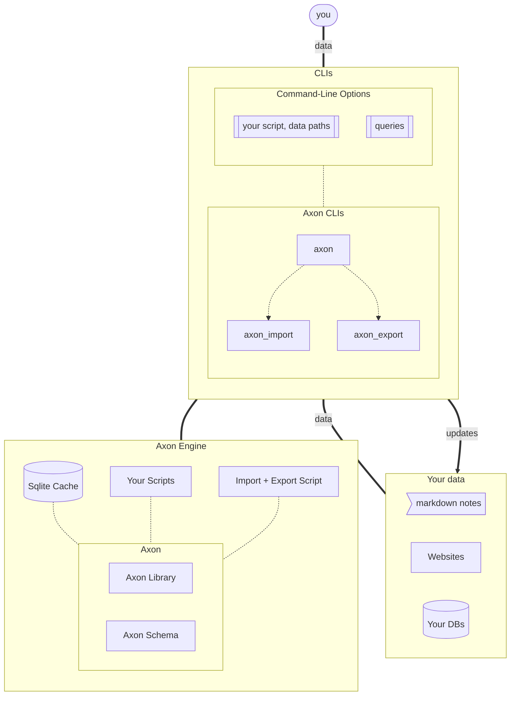

# Axon

I was tired of having my data in mutually incompatable silos (Google Photos,
Pinboard, Markdown Notes, etc.), so I built Axon. Axon reads in data from
various formats, converts it to
[axon-shaped data](https://raw.githubusercontent.com/rgrannell1/axon/main/schemas/axon.json),
and caches it in a local Sqlite database.

I can then use Axon to search this linked-data, back it up, export it, or build
applications that use with interconnected data.

## Importers

- [Marten](https://github.com/rgrannell1/marten): Semantic markdown notes

## Importing Data

You can import data from anywhere, really. I've currently pulled in my
(sanitised) shell-history, pinboard bookmarks, and bank-transaction history.
Imports can be done using an executable script that outputs line-delimited-json,
from json, yaml, csv files directly

```bash
axon import --topic 'zsh_history' --from "$HISTORY_SCRIPT_PATH" "importer.fpath=$HOME/.zsh_history"
```

Or through stdin. For example, here's a mini-todo app built using `axon import`
from stdin

```bash
reminder () {
  local text=$1
  echo "{ \"id\": \"$(date)\", \"reminder\": \"$1\" }\n" | axon import --topic 'my-reminders' -
}

reminder "buy coffee"
```

## Data Format

Axon works with (modestly) semantic data; each object (dubbed a 'thing') must
have an ID so other things can reference it, and a child relationship to other
things can be declared using the "is" property (or includes for parent
relationships). For example, this set of things describes a piece of music and
basic facts about the creators.

```json
{
  "id": "Person",
  "includes": ["Conductor", "Pianist"]
}
{
  "id": "Glenn Gould",
  "is": "Pianist"
}
{
  "id": "Leonard Bernstein",
  "is": ["Composer", "Conductor", "Pianist"]
}
{
  "id:" "https://www.youtube.com/watch?v=BX0II6wZpps",
  "named": "Glenn Gould & Leonard Bernstein : J S Bach bwv1052 - Piano Concerto # 1 , Allegro",
  "is": ["YoutubeURL", "BWV 1052"],
  "performed-by": "Glenn Gould",
  "conducted-by": "Leonard Bernstein"
}
```

Other things can extend this information later.

```json
{
  "id": "Identifier",
  "includes": ["URL", "ISBN"]
}
{
  "id": "URL",
  "includes": ["WikipediaURL"]
}
{
  "id": "Glenn Gould",
  "has": [
    # shorthand for creating a url with an id as its own thing, then linking by id
    ["https://en.wikipedia.org/wiki/Glenn_Gould", "WikipediaURL"],
    ["0195182464", "ISBN"]
  ]
}
```

Over time, you can grow a deeply interconnected knowledge-base of human &
machine-readable information (especially if you use the markdown notes plugin!).

## Diagram



## License

The MIT License

Copyright (c) 2022 Róisín Grannell

Permission is hereby granted, free of charge, to any person obtaining a copy of
this software and associated documentation files (the "Software"), to deal in
the Software without restriction, including without limitation the rights to
use, copy, modify, merge, publish, distribute, sublicense, and/or sell copies of
the Software, and to permit persons to whom the Software is furnished to do so,
subject to the following conditions:

The above copyright notice and this permission notice shall be included in all
copies or substantial portions of the Software.

THE SOFTWARE IS PROVIDED "AS IS", WITHOUT WARRANTY OF ANY KIND, EXPRESS OR
IMPLIED, INCLUDING BUT NOT LIMITED TO THE WARRANTIES OF MERCHANTABILITY, FITNESS
FOR A PARTICULAR PURPOSE AND NONINFRINGEMENT. IN NO EVENT SHALL THE AUTHORS OR
COPYRIGHT HOLDERS BE LIABLE FOR ANY CLAIM, DAMAGES OR OTHER LIABILITY, WHETHER
IN AN ACTION OF CONTRACT, TORT OR OTHERWISE, ARISING FROM, OUT OF OR IN
CONNECTION WITH THE SOFTWARE OR THE USE OR OTHER DEALINGS IN THE SOFTWARE.
