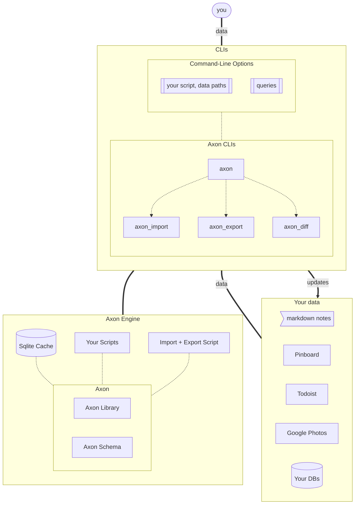

# Axon

## Diagram

```mermaid
flowchart TB

  you([you])

  you ===|data|CLIs

  subgraph Axon[Axon Engine]
    direction TB

    subgraph AxonCore[Axon]
      library[Axon Library]
      schemas[Axon Schema]
    end

    sqlite[(Sqlite Cache)] -.- AxonCore
    yourscripts[Your Scripts] -.- AxonCore
    pbscript[Import + Export Script] -.- AxonCore
  end

  CLIs === Axon

  subgraph CLIs[CLIs]
    direction TB

    subgraph Opts[Command-Line Options]
      direction TB

      opts_1[[your script, data paths]]
      opts_3[[queries]]
    end

    subgraph Rest[Axon CLIs]
      direction TB

      axon -.-> axon_import
      axon -.-> axon_export
      axon -.-> axon_diff
    end

    Opts -.- Rest

  end

  subgraph Sources[Your data]
    md_node>markdown notes]
    pinboard[Pinboard]
    todoist[Todoist]
    photos[Google Photos]
    dbs[(Your DBs)]
  end

  CLIs ===|data| Sources
  CLIs ==>|updates| Sources
```
